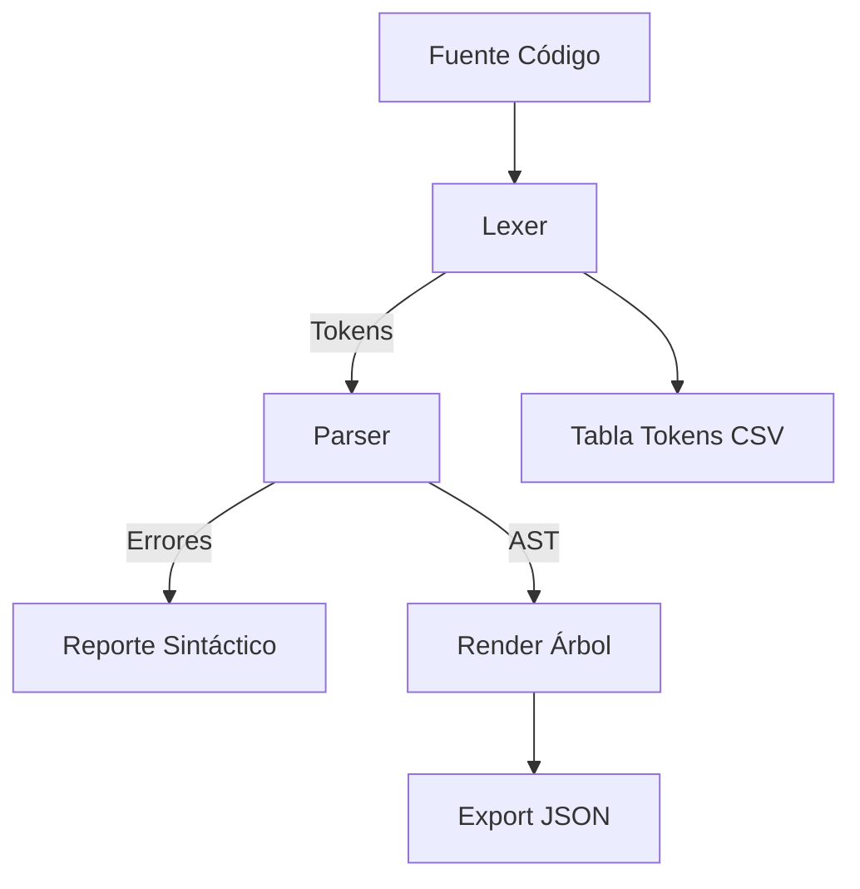

# Analizador Léxico y Sintáctico con Árbol Sintáctico (JavaScript)

Proyecto educativo para la materia "Seminario de Solución de Problemas de Traductores de Lenguajes II". Implementa en **HTML + CSS + JavaScript puro** un analizador léxico y un **parser recursivo descendente** que construye y visualiza el **Árbol Sintáctico Abstracto (AST)**, junto con derivaciones y utilidades de exploración.

---

## 🚀 Características Principales

- Lexer manual basado en expresiones regulares.
- Parser recursivo descendente (precedencia: OR → AND → Igualdad → Relacional → Aditiva → Multiplicativa → Unaria → Término).
- Construcción de nodos AST con exportación a JSON.
- Visualización jerárquica interactiva (expandir/colapsar, límite de profundidad, auto‑scroll).
- Derivaciones (trazado de reglas aplicadas) y resumen inline.
- Exportación de tokens a CSV.
- Detección y reporte de errores léxicos y sintácticos.
- UI mejorada con barra de herramientas y controles accesibles.

---

## 📂 Estructura del Proyecto

```
├── index.html   # Código completo (HTML + CSS + JS)
└── README.md    # Este documento
```

> Todo el comportamiento reside en `index.html` para facilitar la distribución como un único archivo auto‑contenible.

---

## 🧪 Ejecución Rápida

1. Abre `index.html` en tu navegador (doble clic o arrastrar a la ventana).
2. Asegúrate de que el ejemplo de código aparece precargado.
3. Haz clic en **Analizar** o presiona `Ctrl + Enter` (si añadiste atajo).
4. Explora:
   - Panel de tokens
   - Árbol sintáctico interactivo (Expandir / Colapsar)
   - Derivaciones / resumen sintáctico
   - Exportaciones (JSON / CSV)

---

## 🔤 Especificación Léxica (Resumen)

| Tipo              | Patrón                   | Ejemplos     |
| ----------------- | ------------------------ | ------------ | -------------------- | ------ | ---------- | ---- | ------ | ---------- |
| tipo              | `int                     | float        | string               | void`  | int, float |
| palabra reservada | `if                      | else         | while                | return | for        | read | write` | if, return |
| id                | `[a-zA-Z_][a-zA-Z0-9_]*` | suma, x1     |
| número            | `\d+(?:\.\d+)?`          | 10, 3.14     |
| string            | `"([^"\\]                | \\.)\*"`     | "hola"               |
| operadores        | `+ - \* / &&             |              | == != < <= > >= = !` | >=, && |
| separadores       | `, ; ( ) { }`            | ;, {         |
| espacios          | `[\s\r\n\t]+`            | (ignorado)   |
| comentario línea  | `//.*`                   | // nota      |
| comentario bloque | `/\*[\s\S]*?\*/`         | /_ bloque _/ |

Errores léxicos: cualquier símbolo que no coincide con los anteriores.

---

## 📐 Gramática (Fragmento Simplificado)

```
programa       → definiciones
definiciones   → definicion definiciones | ε
definicion     → defVar | defFunc
defVar         → tipo listaVar ;
listaVar       → id restoVars
restoVars      → , id restoVars | ε
defFunc        → tipo id ( parametros? ) bloqFunc
parametros     → tipo id masParam
masParam       → , tipo id masParam | ε
bloqFunc       → { defLocales sentencias }
# ... (bloques, sentencias, expresiones, etc.)
expresion      → expOr
expOr          → expAnd ( '||' expAnd )*
expAnd         → expIgual ( '&&' expIgual )*
expIgual       → expRel ( ( '==' | '!=' ) expRel )*
expRel         → expAdd ( ( '<' | '>' | '<=' | '>=' ) expAdd )*
expAdd         → expMul ( ( '+' | '-' ) expMul )*
expMul         → expUnary ( ( '*' | '/' ) expUnary )*
expUnary       → ( '!' | '-' ) expUnary | termino
termino        → número | id llamada? | string | '(' expresion ')'
llamada        → '(' argumentos? ')'
```

> La implementación adapta la gramática a una forma adecuada para **recursión descendente**, eliminando recursión izquierda directa.

---

## 🧱 Arquitectura Interna



### Ciclo de Análisis

1. Lexer genera lista de tokens (+ errores léxicos).
2. Parser consume tokens con funciones jerárquicas de precedencia.
3. Se construye el AST (nodos con label + hijos).
4. Se generan derivaciones (historial de reglas).
5. UI muestra tokens, árbol, derivaciones y estado.

---

## 🌳 Árbol Sintáctico Interactivo

Funciones de la barra del panel del árbol:

- Analizar: vuelve a ejecutar todo el pipeline.
- Expandir / Colapsar: abre o cierra todos los nodos.
- Profundidad: oculta niveles > N (útil en árboles muy grandes).
- AutoScroll: centra el árbol tras analizar.
- JSON: descarga `parse_tree.json`.
- CSV Tokens: descarga `tokens.csv`.

Click sobre un nodo (etiqueta) → alterna expandir/colapsar individual.

---

## 📤 Exportaciones

- Árbol: serialización del nodo raíz con estructura recursiva.
- Tokens: columnas (lexema, tipo, línea, columna).

---

## 🛠️ Extensiones Sugeridas

| Mejora                  | Idea                                          |
| ----------------------- | --------------------------------------------- |
| Validación semántica    | Tabla de símbolos, detección de redeclaración |
| Tipado básico           | Inferencia y verificación simple              |
| Coloreo en árbol        | Colores por tipo de nodo                      |
| Búsqueda de nodo        | Input para resaltar coincidencias             |
| Minimap de derivaciones | Vista compacta a la derecha                   |

---

## 🖼️ Capturas (Coloca tus imágenes)

Guarda tus pantallas en `docs/` y actualiza rutas.

```text
/docs/captura_tokens.png
/docs/captura_arbol.png
/docs/captura_derivaciones.png
```

Ejemplo en Markdown:

```md


```

---

## 🧩 Preguntas Frecuentes

**El árbol sale vacío**: Verifica primero la sección de errores léxicos.  
**Tipos salen como id**: Asegúrate de que la clasificación de `int|float|string|void` va antes de palabras reservadas genéricas.  
**Se cuelga**: Probablemente un bucle por no avanzar token en una rama de error; revisa funciones de precedencia.

---

## 🧪 Pruebas Manuales Recomendadas

| Caso                    | Entrada        | Esperado                    |
| ----------------------- | -------------- | --------------------------- |
| Declaraciones múltiples | `int a,b,c;`   | listaVar correcta (3 ids)   |
| Función vacía           | `void f(){}`   | Nodo defFunc + bloque vacío |
| Llamada                 | `f(1,2+3,g())` | Nodo llamada con 3 args     |
| Anidación expr          | `(a+3)*b-!-c`  | Precedencia respetada       |

---

## 🗃️ Publicación en GitHub

1. Inicializa Git (si no lo hiciste):
   ```bash
   git init
   git add .
   git commit -m "feat: analizador léxico-sintáctico con AST"
   ```
2. Crea un repositorio vacío en GitHub (web).
3. Asocia el remoto (reemplaza USUARIO y REPO):
   ```bash
   git branch -M main
   git remote add origin https://github.com/USUARIO/REPO.git
   git push -u origin main
   ```
4. (Opcional) Activa GitHub Pages (Branch: main / root) para abrir directamente `index.html`.

---

## 📄 Licencia

Uso académico. Agrega una licencia formal (MIT, Apache 2.0, etc.) si lo distribuyes públicamente.

---

## ✍️ Autoría / Créditos

Desarrollado como ejercicio académico para la materia de Traductores. Personaliza esta sección con tu nombre y matrícula.

---

## ✅ Checklist Rápida

- [x] Lexer
- [x] Parser recursivo
- [x] AST y visualización
- [x] Derivaciones
- [x] Exportaciones
- [x] Controles de UI
- [ ] Tabla de símbolos (futuro)
- [ ] Verificación de tipos (futuro)

---

¿Dudas o quieres extenderlo? Abre un Issue una vez lo subas a GitHub.
